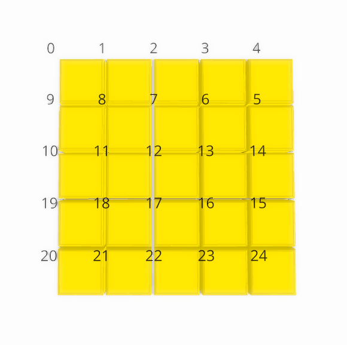

# Shape-Kit

Official web-version implementation of CHI 25' paper: XXX
An interactive shape manipulation and recording system using computer vision and Arduino-controlled servo motors. The system allows real-time tracking and recording of physical pin movements, with both digital visualization and hardware control.

## Getting Started

This guide will help you set up Shape-Kit on your computer, even if you're new to coding!

### Step 1: Download Visual Studio Code

1. Download VS Code from [https://code.visualstudio.com/](https://code.visualstudio.com/)
2. Install VS Code on your computer
3. Open VS Code after installation

### Step 2: Get the Shape-Kit Code

You have two options to get the code:

#### Option A: Download as ZIP (Easiest)
1. Go to the Shape-Kit repository
2. Click the green "Code" button
3. Select "Download ZIP"
4. Unzip the downloaded file
5. Open VS Code
6. Go to File → Open Folder
7. Select the "shapekit-app" folder you just unzipped

#### Option B: Using Git
If you're familiar with Git:
```bash
git clone [repository-url]
cd shapekit-app
```

### Step 3: Install Required Software

#### Install Node.js
1. Go to [Node.js website](https://nodejs.org/)
2. Download the "LTS" (Long Term Support) version
3. Install Node.js on your computer
4. To verify installation, open VS Code's terminal (View → Terminal) and type:
   ```bash
   node --version  # Should show v20.12.2 or higher
   npm --version   # Should show 10.5.0 or higher
   ```

#### Install Python
1. Go to [Python downloads](https://www.python.org/downloads/)
2. Download Python 3.9 for your operating system
3. During installation, make sure to check "Add Python to PATH"
4. To verify installation, in VS Code's terminal type:
   ```bash
   python --version  # Should show Python 3.9.x
   ```

### Step 4: Setup the Project

1. Open VS Code's terminal (View → Terminal)

2. Create a Python virtual environment:
   ```bash
   # On Windows:
   python3.9 -m venv venv
   venv\Scripts\activate

   # On macOS/Linux:
   python3.9 -m venv venv
   source venv/bin/activate
   ```
   You'll see `(venv)` appear at the start of your terminal line

3. Install Python packages:
   ```bash
   pip install -r requirements.txt
   ```

4. Install Node.js packages:
   ```bash
   npm install
   ```

### Step 5: Arduino Setup
1. Download and install [Arduino IDE](https://www.arduino.cc/en/software)
2. Open Arduino IDE
3. Navigate to `arduino/Arduino_code_ran.ino` in your project folder
4. Connect your Arduino board via USB
5. Click the Upload button (→) to upload the code to your Arduino

## Project Structure
```
shapekit-app/
├── arduino/           # Arduino firmware
├── build/            # Production build (auto-generated)
├── files/            # Storage for recorded files
├── public/           # Static assets
├── src/              # React frontend source code
├── app.py            # Python camera/detection backend
├── server.js         # Node.js server
├── requirements.txt  # Python dependencies
└── package.json      # Node.js dependencies
```

## Running Shape-Kit

1. Open VS Code
2. Open the shapekit-app folder
3. Open the terminal (View → Terminal)
4. Activate the virtual environment if you haven't already:
   ```bash
   # On Windows:
   venv\Scripts\activate

   # On macOS/Linux:
   source venv/bin/activate
   ```

5. Start the application:
   ```bash
   npm start
   ```

6. The app will automatically open in your browser at `http://localhost:3001`

If you see any error messages in the terminal, make sure:
- Your virtual environment is activated (you see `(venv)` at the start of the terminal line)
- All installation steps were completed successfully


7. Close the project: when you no longer need the program running, you can do "ctrl +c" in VS Code terminal.


## Usage Guide


#### Shape Sync
1. Click "Calibrate" button
2. Use "Start Syncing" for real-time tracking
3. System will track and replicate physical pin movements

#### Shape Recorder
1. Enter a name for your recording
2. Click "Calibrate" if needed
3. Use Record/Stop buttons
4. Files save automatically

##### File Storage
Recorded patterns are stored in the `files` directory

##### Pin Order
The Shape Display uses a specific pin ordering system as shown below:


##### File Format
The recorded files are stored as JSON arrays, where each frame contains a 5x5 matrix of pin heights:
```json
[
  [ // Frame 1
    [1.0, 1.2, 1.1, 1.0, 1.3], // Row 1
    [1.1, 1.0, 1.2, 1.4, 1.1], // Row 2
    [1.2, 1.3, 1.1, 1.0, 1.2], // Row 3
    [1.0, 1.1, 1.2, 1.3, 1.1], // Row 4
    [1.1, 1.2, 1.0, 1.1, 1.2]  // Row 5
  ],
  [ // Frame 2
    // ... next frame's pin heights
  ]
  // ... more frames
]
```

#### Pattern Tuner
- Load existing recordings
- Create variations
- Mix different patterns
- Save new combinations

#### Shape Replay
- Select recorded files
- Use progress bar for playback control
- Physical pins will move if Arduino is connected

## Troubleshooting

### Camera Connection
- Verify USB connection
- Check for other applications using camera
- Ensure proper lighting
- Try disconnecting/reconnecting

### Arduino Issues
- Check USB connection
- Verify correct firmware upload
- Confirm power supply adequacy
- Check servo connections

### Common Problems
1. Camera Not Found:
   - Restart application
   - Check USB connection
   - Verify camera permissions

2. Arduino Not Responding:
   - Check connection
   - Verify correct firmware
   - Ensure power supply

3. Poor Tracking:
   - Improve lighting
   - Recalibrate system
   - Adjust camera position


## Contact
For questions, please contact xxxx.


## Acknowledgements
We would like to thanks the
